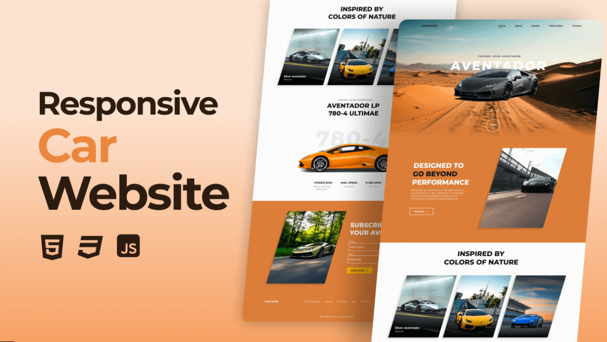

# 🚗 Responsive Car Website

A sleek, modern, and fully responsive car landing page built using **HTML**, **CSS**, and **JavaScript**. This website showcases luxury cars with beautiful visuals, smooth transitions, and an interactive UI using the [SwiperJS](https://swiperjs.com/) library.

## 🔗 Live Demo

> ## 🌐 [Click here to view the live demo]  
> https://jspharry.github.io/Responsive-Car-Website/

---

## ✨ Features

- 🔥 Fully responsive design (mobile, tablet, and desktop friendly)
- 🚀 SwiperJS integration for sleek carousels
- 🖼️ Car model showcase with details
- 📬 Subscription form
- 🎨 Smooth scroll, modern typography, and attractive color schemes
- ⚙️ Clean and well-structured code

---

## 🛠️ Tech Stack

- **HTML5**
- **CSS3**
- **JavaScript**
- **SwiperJS** - [https://swiperjs.com/](https://swiperjs.com/)

---

